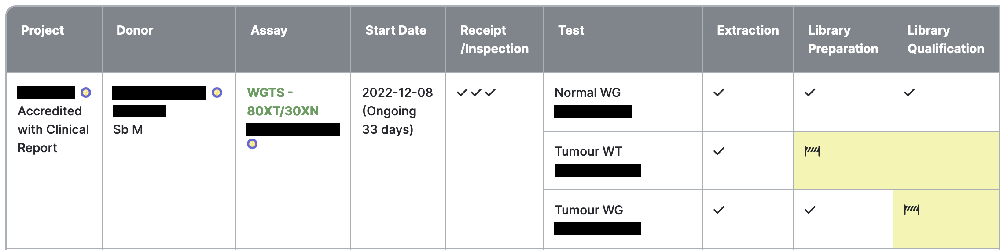

# Cases Page

The Cases page includes all cases for all of your projects. Here, you can see a compact view of
each case.

By default, the table is sorted by latest activity, showing the cases with the most recent updates
at the top.

To access the Cases page, click the green "Cases" link in the top right corner of the page.

## Cases Table Columns

### Project

Lists the project(s) involved in the case, and their appropriate pipeline. Multiple projects will be
involved in cases where relevant samples from the case's donor have been propagated to a different
project.

Clicking on a project name will take you to the [Project Details](details.md) page.

### Donor

Lists the case donor's internal and external names, and the tumour tissue origin, tissue type, and
timepoint examined in the case.

Clicking on the donor name will take you to the [Donor Details](details.md) page.

### Assay

Lists the case assay and requisition.

If the case is stopped, the text "CASE STOPPED" also appears here. Hovering over the text will
display the stop reason in a tooltip. If the case is paused, similar text and tooltip are displayed
in the same place.

Clicking on the requisition name will take you to the [Requisition Details](details.md) page.

Clicking on the "Case Details" link will take you to the [Case Details](details.md) page.

### Start Date

Displays the case start date. Start date is the earliest receipt date of
the receipt sample(s) involved in the case.

### Test

Each assay includes one or more tests.

### QC Steps

The following are QC step columns:

- Receipt/Inspection
- Extraction
- Library Preparation
- Library Qualification
- Full-Depth Sequencing
- Analysis Review
- Release Approval
- Release

Each QC step cell includes icons representing the QC status of each item relevant to that step. A
checkmark represents an item that has passed QC. Click the Legend button at the top or bottom of the
table for a full list of statuses and their icons. Analysis review, release approval, and release
are considered complete when all sign-offs have been completed, regardless of the QC status chosen.
Other steps require a single passing item to be considered complete. Hover over an icon to view a
tooltip containing item details and relevant links.

A QC step cell is shaded yellow if the step has not been completed.

A QC step cell is shaded grey if it is not applicable for the test. For example, if stock samples
were received, extraction is not necessary.

### Latest Activity

Displays the latest date that an item involved in the case was created, modified, or signed-off.
