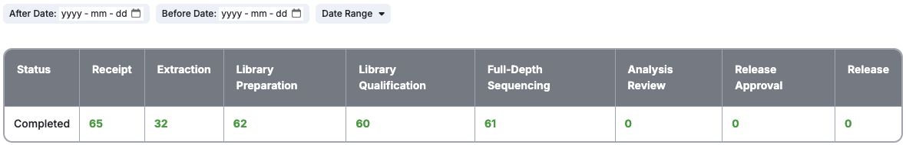

# Detail Pages

Projects, donors, requisitions, and cases each have their own Details page. The Details page
includes more information about the selected item, and all of its cases and QC steps. Clicking on
the name of a project, donor, or requisition takes you to the corresponding details page. Clicking
the "Case Details" link in the cases table links to the Case Details page.

## 1. Project, Donor, Case, and Requisition Details Page

The Details page includes tables detailing the following:

- Cases
- Receipts
- Extractions
- Library Preparations
- Library Qualifications
- Full Depth Sequencings
- Analysis Review
- Release Approvals
- Releases

Navigate through each of the tables using the tabbed bar at the top of the page.

## 3. Project Details Page

In addition to the usual Detail page tables, the Project Details page features a table at the top
showing summary counts of the tests that are completed each QC step.

Any filters applied to the below tables will also affect the summary table. Clicking any of the
counts will apply a related filter to both tables. For example, clicking the count of tests that are
completed full-depth sequencing will filter to show only the items that are completed full-depth
sequencing.

There are additional controls above the summary table which allow you to filter by a date range to
show counts of the work that was completed within the selected period.

---

For more information on common page and table features, see [Common Features](features.md).
