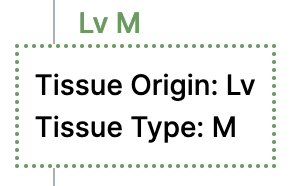
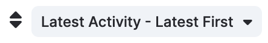
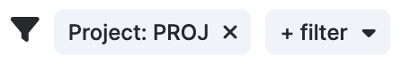
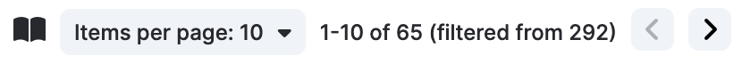

# Common Features

## Links

Text links within Dimsum usually take you to other pages within Dimsum. For example, clicking a
project name will take you to the [Project Details](details.md) page.

## Tool Tips

Hovering over certain text will cause a "Tool Tip" to pop up, which can clarify or provide more
details about data that is initially displayed in a compact form.

## Tables

Tables in Dimsum have a standard set of controls added above and/or below the table.

### Sorting

Tables can be sorted by clicking the dropdown next to the sort icon at the top left of the table and
selecting the desired option. Sort options will differ depending on the table.

### Filtering

Tables can be filtered based on different criteria depending on the table. To apply a filter, click
the "+ filter" dropdown and select the type of filter you wish to apply. Some filter types will
prompt you to select a value from a dropdown, while others may require you to enter text to make
your selection. Applying any filters will automatically refresh the page with entries that follow
all the filter requirements.

Multiple filters can be applied to a table. Filters of the same type will be treated as "OR"
conditions, while different filter types function as "AND" conditions. For example, you can view all
cases with a WGTS assay and involving either the PROA or PROB projects by applying the following
filters.

- Assay: WGTS
- Project: PROA
- Project: PROB

To remove a filter, click the 'x' on its label to the left of the "+ filter" button.

Following the selection of filters, the URL in the browser's address bar is updated. This can be
bookmarked to save a set of filters that you use frequently, or copied to share with other users.

### Pagination

Adjust the number of entries in the table by clicking on the "Items per page" drop down at the top
right of the table and selecting the number of entries you'd like to see.

Move between pages in the table using the "<" (previous) and ">" (next) buttons that appear at both
the top right and bottom right of the table.

### Action Buttons

Action buttons are included on some tables, allowing you to work with the tables or the items within
them. Some of the actions require a selection. You can select items in the table using the
checkboxes in the left-most column.
