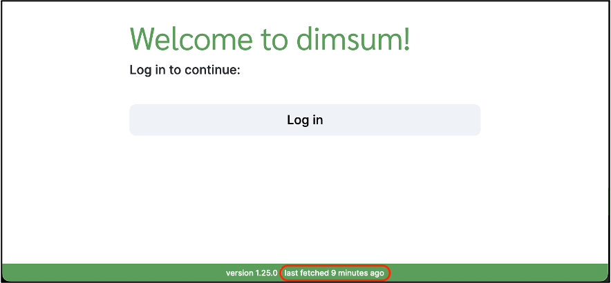
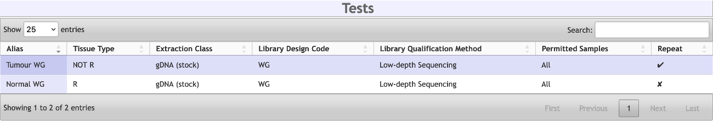
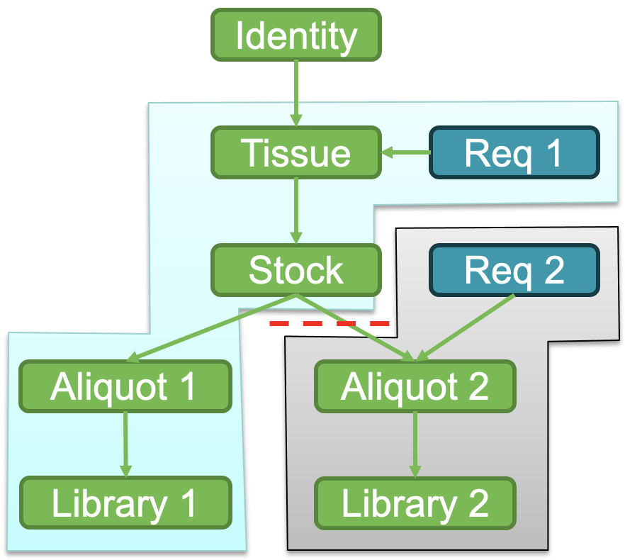
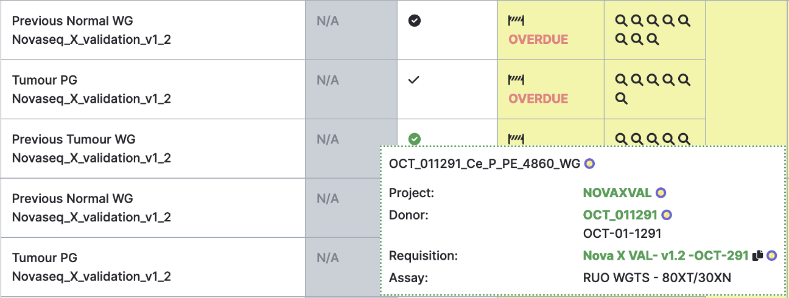
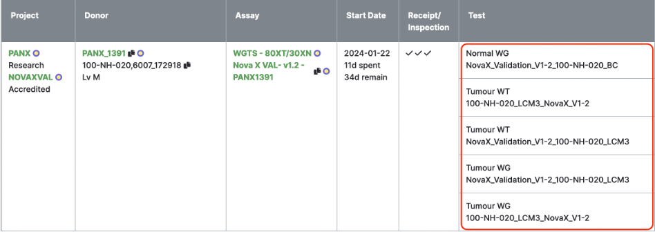
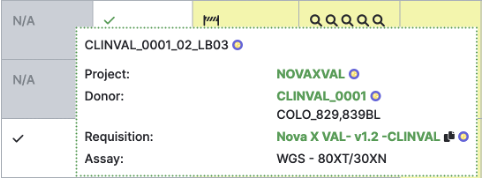
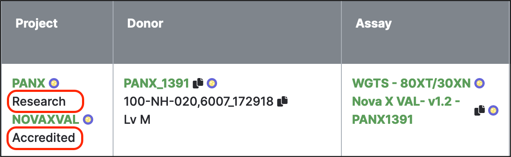
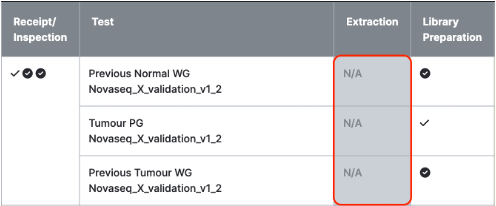
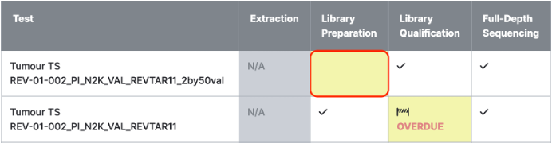
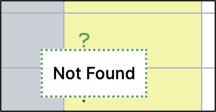

# Frequently Asked Questions

## Why hasn't my work appeared in Dimsum?

1. Dimsum is periodically updated with data from other systems. Check the page footer to see when
the last refresh happened.

     
    *Fetch time in page footer*

1. The sample/library must have a requisition with a proper assay
    * The Edit Sample/Library page in MISO shows the requisition and assay(s) that an item is
    associated with.
1. Only items tied to a QC step appear in Dimsum.

    | Dimsum QC Step | Subcategory | MISO Item |
    | -------------- | ----------- | --------- |
    | Receipt |  | Requisitioned sample/library (any sample class) |
    | Extraction |  | Stock sample |
    | Library Preparation | TS* | First TS library or library aliquot in the hierarchy |
    | Library Preparation | Low-depth sequencing | Library |
    | Library Qualification | TS* | Last TS library aliquot in hierarchy; sometimes same item as library prep |
    | Library Qualification | Low-depth sequencing | Run-library with run purpose “Quality Control” |
    | Full-Depth Sequencing |  | Run-library with run purpose "Production” |
    
    *and other assay tests that use library aliquots for qualification. Others may use a different library design code

1. Is there a case containing parent samples?
    * Child samples/libraries only show up if they are relevant to an assay test within the case.
    E.g. If the assay is WGS and you created a TS library, this will not be shown
    * The assay page in MISO shows the test parameters

     
    *MISO assay tests*

## Why can’t I select the assay I want?

* Assay availability is configured at the project level (Edit Project > Assays table)
* If the requisition contains samples/libraries from multiple projects, all projects must have the assay
* Ensure that the requisitioned samples/libraries are in the project you intended
  * You can check the Edit Requisition page to quickly see each item's project
  * Libraries cannot be moved between projects - they belong to the same project as their parent sample

## How do I remove samples/libraries from a case?

* A sample/library only belongs to a single requisition
* Children of requisitioned samples/libraries belong to the requisition of the parent
* Moving a child item to a different requisition removes it and any of its descendants from the original requisition
* Removing items from a requisition removes them from any cases for that requisition

     
    *Example: Moving Aliquot 2 into its own requisition removes Aliquot 2 and Library 2 from the original requisition and its cases.*

## How do I include previous work in a new case?

**Why?**

* Reuse reference/normal
* Include the previous normal and tumour for follow-up cases such as pWGS

**How?**

Add the relevant samples/libraries as supplemental in the new requisition

* Leaves the items in their original requisition, but also includes them in the new one
* Supplemental items’ projects/pipelines are not associated with the case
* Supplemental items are not included in TAT calculation
* Supplemental items may have been QC’d under a different assay. Dimsum will indicate this

     
    *The circle/checkmark icon indicates items passed under a different assay. The tooltip shows which assay.*

## Why are there extra tests in my case?

Usually this is caused by group IDs. Different group IDs cannot merge, so they create separate
tests. Items that have **NO** group ID also cannot merge with other items that **DO** have a group
ID.

 
*Group ID is included in the Test column in Dimsum.*

## Why is my case associated with a particular project?

* Case projects come from requisitioned samples/libraries and any of their descendants that are
included in the case
  * Supplemental samples/libraries are not considered
  * The Identity sample (donor) is not considered
    * Sometimes a donor is in an “accessioning project” separate from the “sequencing project”
* Note that a library belongs to the same project as its parent sample – libraries do not set their
own project

 
*You can hover over items in Dimsum to see their project*

## How do I limit my case to a single project?

Some cases are associated with multiple projects. This is usually caused by samples having been
previously received into one project, then the samples themselves were used for sequencing in a
different project. If the samples had previous data that could be used, then they could have been
added as supplemental to the new requisition, and supplemental samples do not effect the case's
projects. If the samples had to be derived and sequenced, they should have undergone the process
described in the example below instead:

X1 is a tumour tissue sample – received in Project A for WTS

- Accessioned into Project A; Requisition 1 – WTS Assay
- Dual extraction done: X1TDNA and X1TRNA are the propagated samples
- X1TRNA aliquot transferred to library prep team

X2 is a buffy coat sample – received for Project B a year later for WGTS

- Accessioned into Project A, then changed to Project B (assumes knowledge that this is for a
  different project that already exists – often true but not always); Requisition 2 – WGTS Assay
- DNA extraction done: X2BCDNA is the propagated sample
- X2BCDNA aliquot transferred to library prep team
- X1TDNA aliquot transferred to library prep team

Option 1:

X1TDNA stock and X1TRNA aliquot can be added as a supplemental samples to Req 2. This needs to be
the case with X1TRNA if the same WTS data previously generated is being used for the newly requested
WGTS Assay.

Option 2:

X1TDNA and X1TRNA should have new aliquots propagated into Project B. These should be added as
requisitioned samples to Requisition 2.

Using either option, the requisitioned samples in Requisition 2 and everything downstream of them
are associated with Project B, so that will be the only project associated with the WGTS case.

## Why is my case associated with a particular pipeline?

Case pipelines come from the case’s projects. See previous question regarding case project
association.

 
*Case pipelines*

## Why does my case have a particular deliverable?

Case deliverables are also defined by the case's projects. See previous question regarding case
project association.

## Why are there missing steps in a test?

1. Step appears grey with "N/A" text

     
    *Extraction is skipped for these tests*

    * **Extraction** will be marked N/A if stock/aliquot samples or libraries are requisitioned because
    we are not doing the extraction
    * **Library preparation** will be marked N/A if libraries are requisitioned because we are not doing
    the library preparation
    * **Library qualification** is skipped (and marked N/A) for some assay tests
      * Mainly intended for injection cases, where we receive sequencing data from a collaborator,
      and we are only doing analysis
    * When a case is stopped, all incomplete QC steps before Release Approval will be marked N/A
      
2. Step appears yellow/incomplete with no icons in it, while later steps show work in progress or
completed

     
    *Library Preparation step is missing*

    * This is usually because a group ID was added later in the process
    * E.g. A new group ID is added to a library aliquot
        * This creates a separate test for the group ID
        * There are no samples/libraries with a matching group ID to include in that test, so
        extraction and library prep will be missing/incomplete
    * Consider whether this group ID should be in a separate case. If so, move the relevant
    samples/libraries to a different requisition

## Why is a metric missing?

* Some metrics depend on a particular attribute. E.g. tissue material
  * If this attribute is not set, there is no metric
  * Some attribute values may not have a corresponding metric
* If the metric appears in Dimsum, but has no value, the value is not set in its usual place
  * See QM-024 Quality Control and Calibration Procedures – Appendix A – QC Metrics, which details
  where all metrics come from

     
    *Metric value missing*

## How do I close a case?

* A case is only closed when the release step QC is completed for each deliverable
* There can be failures at any step, but it may be possible to continue the case by repeating some
work
  * E.g. if library preparation fails, maybe another library prep can be attempted
* A case may be stopped (at the requisition level), but stopped cases still require release approval
and release
  * Any other incomplete gates are marked “N/A” when the case is stopped
