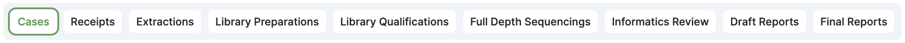

# Detail Pages

Projects, donors, requisitions, cases, and runs each have their own Details page. The Details page
includes more information about the selected item, all of its cases and QC steps, and the metrics
for each associated item. Clicking on the name of a project, donor, requisition, or run takes you to
the corresponding details page. Clicking the "Case Details" link in the cases table links to the
Case Details page.

### Metrics

Columns containing QC metrics provide tool tips detailing the exact required threshold. Hover over
the recorded number to see its requirements. The cell will be shaded red if a requirement is not
met, and yellow if the value is unavailable.

## 1. Project, Donor, Case, and Requisition Details Page

The Details page includes tables detailing the following:

- Cases
- Receipts
- Extractions
- Library Preparations
- Library Qualifications
- Full Depth Sequencings
- Analysis Review
- Release Approvals
- Releases

Navigate through each of the tables using the tabbed bar at the top of the page.

## 3. Project Details Page

In addition to the usual Detail page tables, the Project Details page features a table at the top
showing summary counts of the tests that are pending work, pending QC, and completed each QC step.

Any filters applied to the below tables will also affect the summary table. Clicking any of the
counts will apply a related filter to both tables. For example, clicking the count of tests that
have completed full-depth sequencing will filter to show only the items that have completed
full-depth sequencing.

There are additional controls above the summary table which allow you to filter by a date range to
show counts of the work that was completed within the selected period.

## 2. Run Details Page

This page includes details about the selected run including its QC status, flow cell, and
parameters. A table showing all of the library qualification and/or full-depth sequencing results is
included below, as applicable for the selected run.

### Bulk QC Operations in MISO

To perform bulk QC operations in MISO, select the desired table entries by clicking the checkbox at
the left of each item you wish to include. Next, scroll to the bottom of the table and click the
"QC in MISO" button. This will open the MISO
[Run-Library Metrics](https://miso-lims.readthedocs.io/projects/docs/en/latest/user_manual/qc_integration/)
page in a new tab. You can then perform your desired QC operations for all of the selected items.

---

For more information on common page and table features, see [Common Features](features.md).
