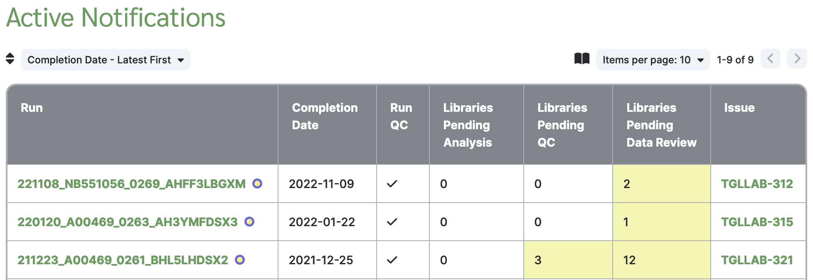

# Notifications

Dimsum creates notifications for runs that have pending analysis, QC, and/or data review so that
users know when sign-offs are required and the information needed to do so is available. These
notifications are primarily in the form of JIRA tickets, but can also be viewed within Dimsum.

For library qualification runs, a notification is not created until analysis is completed for all
run-libraries. For full-depth sequencing, a notification is created as soon as analysis is completed
for at least one run-library.

## JIRA Tickets

A JIRA ticket is created automatically for each run, and includes

- The run-level QC state - whether the run is pending QC or data review, or QC is completed
- A count and list of run-libraries that are pending QC
- A count and list of run-libraries that are pending data review
- A count of run-libraries that are still pending analysis and not yet ready for QC
- A link to the Dimsum [Run Details](details.md) page, where you can view metrics and
  start the sign-off process

When any of this information changes, Dimsum will post a comment on the ticket with the updated
information. Dimsum will also update the ticket status if necessary:

- When any sign-offs are required, the ticket is open
- When all possible sign-offs are complete, but there are still run-libraries pending analysis, the
  ticket is closed with resolution "Incomplete."
- When all run-libraries have completed analysis and sign-offs, the ticket is closed with resolution
  "Done."

If you wish to close a ticket and prevent Dimsum from reopening it, set the resolution to "Won't
Do."

## Active Notifications Page

To view active notifications in Dimsum, click the green "Notifications" link at the top right of the
page. This page lists all active notifications, including

- The run name, linking to the Run Details page
- Run completion date
- Run QC status
- Counts of libraries that are pending analysis, QC, and data review
- The JIRA ticket number, linking to JIRA

---

For more information on common page and table features, see [Common Features](features.md).
