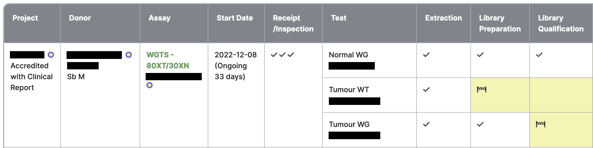
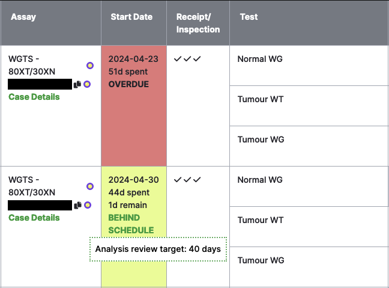

# QC Dashboard

This is the main dashboard users are presented with. All cases are presented in a table format. See
[Cases](cases.md) for details about how cases are constructed. Navigate back to this page
by clicking on the Dimsum logo on the top left of all pages.

By default, the table is sorted by urgency. Overdue cases are considered most urgent, followed by
those behind schedule, and then cases with the least time remaining.

## Cases Table Columns

### Project

Lists the project(s) involved in the case, and their appropriate pipeline. Multiple projects will be
involved in cases where relevant samples from the case's donor have been propagated to a different
project.

Clicking on a project name will take you to the [Project Details](details.md) page. Clicking on the
MISO icon next to the project name will open the MISO
[Edit Project](https://miso-lims.readthedocs.io/projects/docs/en/latest/user_manual/projects/#edit-project-page)
page in a new tab.

### Donor

Lists the case donor's internal and external names, and the tumour tissue origin, tissue type, and
timepoint examined in the case.

Clicking on the donor name will take you to the [Donor Details](details.md) page. Clicking on the
MISO icon next to the donor name will open the MISO
[Edit Sample](https://miso-lims.readthedocs.io/projects/docs/en/latest/user_manual/samples/#editing-a-single-sample)
page for the donor in a new tab.

### Assay

Lists the case assay and requisition.

If the case is stopped, the text "CASE STOPPED" also appears here. Hovering over the text will
display the stop reason in a tooltip. If the case is paused, similar text and tooltip are displayed
in the same place.

Clicking on the requisition name will take you to the [Requisition Details](details.md) page.
Clicking on the MISO icon next to the requisition name will open the MISO
[Edit Requisition](https://miso-lims.readthedocs.io/projects/docs/en/latest/user_manual/requisitions/#editing-requisitions)
page in a new tab.

Clicking on the "Case Details" link will take you to the [Case Details](details.md) page.

### Start Date

Displays the case start date and total turn-around time. Start date is the earliest receipt date of
the tumour sample(s) involved in the case. For ongoing cases, the turn-around time is the number of
days from the start date until the current date. For completed cases, the turn-around time is the
number of days from the start date until the Release sign-off.

If the case's assay has turn-around time (TAT) targets defined, this column also displays the number
of days remaining for the case, and warnings if the case isn't meeting the targets.

* If the case TAT target has passed, "OVERDUE" is displayed and the cell is shaded red. Hovering
  over the text will open a pop-up indicating the case target
* If one or more QC steps have passed their TAT targets, "BEHIND SCHEDULE" is displayed and the cell
  is shaded yellow. Hovering over the text will open a pop-up indicating which gate is behind
  schedule and its target

### Test

Each assay includes one or more tests. Tests must be repeated for each group ID present. See
[Cases](cases.md) for more details about how cases are constructed.

### QC Steps

The following are QC step columns, and their associated items:

| Step/Column           | Item type                                                 |
| --------------------- | --------------------------------------------------------- |
| Receipt/Inspection    | Requisitioned samples                                     |
| Extraction            | Stock samples                                             |
| Library Preparation   | Libraries                                                 |
| Library Qualification | Library aliquots or run-libraries, depending on the assay |
| Full-Depth Sequencing | Run-libraries                                             |
| Analysis Review       | Requisition-level QC                                      |
| Release Approvals     | Requisition-level QC                                      |
| Releases              | Requisition-level QC                                      |

Each QC step cell includes icons representing the QC status of each item relevant to that step. A
checkmark represents an item that has passed QC, while an 'X' represents a QC failure. Click the
Legend button at the top or bottom of the table for a full list of statuses and their icons. A
single passing item is required for the step to be considered complete. Hover over an icon to view a
tooltip containing item details and relevant links.

If the case's assay has turn-around time (TAT) targets defined, these columns also display the
number of days remaining for the step, and an "OVERDUE" warning if the step has exceeded its target.
Hovering over this text will open a pop-up indicating the step's TAT target.

A QC step cell is shaded yellow if the step has not been completed.

A QC step cell is shaded grey if it is not applicable for the test. For example, if stock samples
were received, extraction is not necessary.

### Latest Activity

Displays the latest date that an item involved in the case was created, modified, or signed-off.

## Case Actions

Action buttons on the Cases table allow you to download several reports, and [complete case-level
sign-offs](guides/sign_off_case.md).
